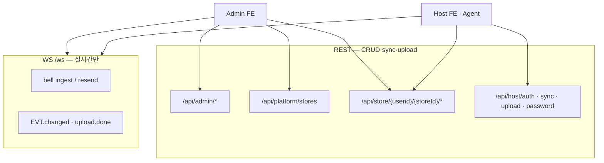

# LNSMS 구현 계획 (Final)

> Greenfield · 레거시·호환 없음  
> 실시간: [lunarmsg.md](lunarmsg.md) · sets: [docs/setid.md](docs/setid.md)

---

## 0. 한 줄

**기본 오프라인 — 로컬 Mongo `necall.guest` 고정.** 기동 시 **로컬 Host JWT 자동 발급** → CRUD는 일반 로그인과 동일.  
**원격 로그인** = sync 전용(별도 JWT). **replace+경고.** 로컬 Host FE **WS 없음.**

---

## 1. 명칭 (확정)

| 필드 | 의미 | 절대 규칙 |
|------|------|-----------|
| **userid** | **업체(테넌트) ID** | 매장 ID로 쓰지 않음 |
| **storeId** | **매장 ID** | 업체 ID로 쓰지 않음 |
| **eqId** | StoreKey 내 기기 ID | |
| **StoreKey** | `` `{userid}.{storeId}` `` | 검색·권한·URL·JWT 1차 기준 |

---

## 2. 아키텍처



| 구분 | REST | WS |
|------|------|-----|
| Platform Admin | ✅ stores CRUD | ❌ |
| Admin `/s/...` 편집 | ✅ Store REST | ✅ 이벤트 수신만 |
| Host `/s/...` | ✅ Store REST | ✅ 이벤트 수신만 |
| Agent bell | ✅ (선택 ACK) | ✅ ingest / resend |
| sets / categories / menus / devices / context | ✅ REST | ❌ (변경 알림만 EVT) |

---

## 3. 확정 결정

### A. 데이터

| | |
|-|-|
| A1 | **`stores`만** — 별도 업체 컬렉션 없음 |
| A2 | 자식 FK = **`{ userid, storeId }`** — storeRef(ObjectId) 없음 |
| A3 | **eqId** — StoreKey 내부 unique |
| A4 | setid·phrases·serial **구조** = setid.md. greenfield 필드: **`userid`(업체), `storeId`(매장), `setid`** |

### B. bell (WS)

| | |
|-|-|
| B1 | 전 eq resend. eq별 **동일 `eventId` 2회째~5초 디바운스** |
| B2 | 전 eq (allow-list 없음) |
| B3 | Mongo `bell_events` |
| B4 | ingest **5초 내 재전송** 큐 |

### C. Agent · Host (로컬)

| | |
|-|-|
| C1 | sets → **REST** (로컬 BE) |
| C2 | **수동 sync** — 원격 Host JWT + **온라인** 시만 업/다운 (§10) |
| C3 | WebView — 로컬 REST, **기동 시 auto-login** (`necall.guest`) |
| C4 | **로컬 Host FE = WS 없음**. 원격 WS는 원격 로그인+온라인 시 Agent bell만 |
| C5 | **LocalStack** — Host 기동 시 로컬 포트 kill + BE/FE/Mongo (§10) |
| C6 | **로컬 StoreKey 상수** — 항상 `necall.guest`; CRUD는 **guest 분기 없음** |
| C7 | **기본 오프라인** — 로컬 Mongo; sync만 원격 JWT |
| C8 | FE **우측 상단** — `오프라인`/`온라인` 뱃지 + **로그인** 버튼(원격) |

### D. Admin FE

| | |
|-|-|
| D1 | `/s/...` **진입 시 WS connect** (이벤트 수신). CRUD는 REST |

### E. 파일·sync

| | |
|-|-|
| E1 | **tus** 일괄 upload |
| E2 | **DID 제외** |
| E3 | **sync export/import = Host only** — Platform UI·API **없음** |

### F. 운영·인증

| | |
|-|-|
| F1 | **Mongo wipe** |
| F2 | Admin **admin / admin** (운영 env 교체) |
| F3 | **access + refresh** JWT |
| F4 | `PUT /api/host/{userid}/{storeId}/password` |

---

## 4. REST API (전체)

### 4.1 Admin (`aud=platform`)

| Method | Path |
|--------|------|
| POST | `/api/admin/auth/login` |
| POST | `/api/admin/auth/refresh` |
| GET | `/api/admin/auth/verify` |
| GET/POST/PUT/DELETE | `/api/platform/stores` |

**Platform은 export/import 없음** (E3).

### 4.2 Host (`aud=host`)

| Method | Path |
|--------|------|
| POST | `/api/host/auth/login` |
| POST | `/api/host/auth/refresh` |
| GET | `/api/host/auth/verify` |
| PUT | `/api/host/{userid}/{storeId}/password` |
| POST | `/api/host/{userid}/{storeId}/upload` (tus) |
| POST | `/api/host/{userid}/{storeId}/sync/export` |
| POST | `/api/host/{userid}/{storeId}/sync/import` |

### 4.3 Store CRUD (`aud=platform` \| `aud=host`)

Base: **`/api/store/{userid}/{storeId}`**

| Path | ops |
|------|-----|
| `/context` | GET, PUT |
| `/categories`, `/categories/:id` | CRUD |
| `/menus`, `/menus/:id` | CRUD |
| `/devices`, `/devices/:id` | CRUD |
| `/sets`, `/sets/:setid` | CRUD (setid.md) |

- **Admin JWT** → 모든 StoreKey
- **Host JWT** → claim `{userid, storeId}` 일치만

변경 성공 시 서버가 WS **`EVT.changed`** 브로드캐스트 (클라이언트는 REST로 list/get).

### 4.4 공통

`GET /health`, `GET /uploads/*`

---

## 5. WS (LUNARNET) — 실시간만

Path: `wss://…/ws` — [lunarmsg.md](lunarmsg.md)

| 용도 | tag / topic |
|------|-------------|
| 세션 | `lnsms.session` — hello, listen, ping |
| bell ingest | `lnsms.bell` — `REQ.ingest` |
| bell resend | `lnsms.bell` — `EVT.resend` |
| 데이터 변경 알림 | `lnsms.store.{userid}.{storeId}.{entity}` — **`EVT.changed`** |
| upload 완료 | `lnsms.store.{userid}.{storeId}.upload` — **`EVT.upload.done`** |

**WS에 CRUD REQ 없음** — list/get/create/update/delete 전부 REST.

---

## 6. UI

| 페이지 | REST | WS |
|--------|------|-----|
| `/login` | Admin auth (원격) | — |
| Host `/s/necall/guest/*` | **로컬** Store REST (auto-login JWT) | **없음** |
| Host **로그인** 버튼 | **원격** `POST /api/host/auth/login` (모달) | — |
| Host sync 패널 | 원격 sync (**원격 JWT + 온라인**만) | — |

**Host FE AppBar 우측:** `오프라인`/`온라인` 뱃지 + **로그인** 버튼 (§10.3·§10.7).

> Platform `/platform`·Admin `/login`은 원격 admin.necall.com 전용. Host WebView에는 **별도 `/store/login` 페이지 없음** — 로그인 버튼 모달로 대체.

---

## 7. MongoDB

| 컬렉션 | unique |
|--------|--------|
| `admin_users` | `username` |
| `stores` | `{ userid, storeId }` |
| `categories`, `menus`, `devices` | `{ userid, storeId }` + id |
| `set_configs` | `{ userid, storeId, setid }` |
| `bell_events` | `eventId` (TTL) |

F1: **기존 DB 삭제 후 seed.**

---

## 8. set_configs (setid.md + greenfield)

```json
{
  "userid": "vendor-a",
  "storeId": "shop-01",
  "setid": "set-01",
  "phrases": {},
  "serial": {}
}
```

- `userid` = **업체 ID** (setid.md의 구 `agentId` 역할)
- `storeId` = **매장 ID**
- bundle export/import: `{ userid, storeId, collections… }` — **storeRef 없음**

---

## 10. C# Host · 로컬 스택 (LocalStack)

### 10.1 상수 StoreKey (로컬)

| 상수 | 값 |
|------|-----|
| `LOCAL_USERID` | `necall` |
| `LOCAL_STORE_ID` | `guest` |
| **StoreKey** | **`necall.guest`** |

- Host 로컬 스택 **전 구간** 이 키만 사용 (Mongo·URL·REST·세팅).
- **원격 재로그인해도 로컬 StoreKey·로컬 JWT claim은 변경하지 않음.**
- 원격 sync 시에만 **원격 JWT**의 `{ userid, storeId }` 사용 (§10.6).

### 10.2 Host 기동 · 로컬 auto-login

```
C# Host 실행 → LocalStack (Mongo · BE · FE)
WebView → /s/necall/guest/setting
FE 마운트 → POST local /api/host/auth/login { necall, guest, password }
         → host_token 저장 → CRUD·가드 = 일반 Host와 동일 (guest 분기 없음)
AppBar → [오프라인|온라인] + [로그인] (원격 sync JWT)
```

### 10.3 인증 2축 (로컬 vs 원격)

| | 로컬 `host_token` | 원격 `remote_host_token` |
|---|-------------------|---------------------------|
| **발급** | 기동 **자동** (`necall`/`guest`) | AppBar **로그인** 버튼 |
| **API base** | `127.0.0.1:40000` | `admin.necall.com` |
| **용도** | CRUD·세팅·tus(로컬) | sync export/import |
| **StoreKey** | `necall.guest` | JWT `{ userid, storeId }` |
| **만료/재발급** | refresh (로컬) | 로그인 버튼으로 **재로그인** |

**로그인 버튼 UX**

- AppBar 우측: `[오프라인|온라인]` 뱃지 + **로그인** (또는 로그인됨 시 `{userid}.{storeId}` + 로그아웃)
- 클릭 → 모달: userid, storeId, password → 원격 login → `remote_host_token` 저장
- **로컬 `host_token`은 건드리지 않음** — 화면·URL·CRUD 그대로 `necall.guest`

### 10.4 오프라인 우선

| | |
|-|-|
| **기본** | 오프라인 — CRUD → 로컬 Mongo (`host_token` = necall.guest) |
| **WS** | 로컬 Host FE **없음** |
| **sync** | `remote_host_token` + 온라인일 때만 활성 |

### 10.5 sync (원격만)

**조건:** `remote_host_token` 유효 + **온라인** (뱃지 `온라인`).

| 버튼 | 동작 |
|------|------|
| **서버로 업로드** | 로컬 export (`necall.guest`) → 원격 import (`remote JWT` StoreKey, **replace**) |
| **서버에서 다운로드** | 원격 export → 로컬 import (`necall.guest`, **replace**) |

- **무조건 덮어쓰기** — 실행 전 **경고 확인창**.
- **원격 미로그인 / 오프라인:** sync 버튼 disabled.

### 10.6 로컬 vs 원격 요약

| | 로컬 | 원격 |
|---|------|------|
| **StoreKey** | **`necall.guest` 고정** | JWT `{ userid, storeId }` |
| **토큰** | `host_token` (auto) | `remote_host_token` (로그인 버튼) |
| **API** | `127.0.0.1:40000` | `https://admin.necall.com` |
| **FE URL** | `/s/necall/guest/*` 고정 | sync 호출만 |
| **WS** | 없음 | 원격 로그인+온라인 시 Agent bell (선택) |

### 10.7 app.json

```json
{
  "userid": "necall",
  "storeId": "guest",
  "eqId": "eq-local",
  "localStackEnabled": true,
  "lnsmsApiBaseLocal": "http://127.0.0.1:40000",
  "lnsmsUiBaseLocal": "http://127.0.0.1:63001",
  "lnsmsApiBaseRemote": "https://admin.necall.com",
  "lnsmsWsUrlRemote": "wss://admin.necall.com/ws",
  "killExistingOnStart": true,
  "localGuestPassword": "guest"
}
```

- `localGuestPassword`: 로컬 auto-login 전용 (F1 seed와 동일). **원격과 무관.**

### 10.8 FE 상태 · AppBar

- **우측 상단:** `[오프라인|온라인]` + **로그인** 버튼
- `오프라인` — 기본 (로컬만)
- `온라인` — 원격 `/health` OK **且** `remote_host_token` 유효
- sync enabled ↔ `온라인`

### 10.9 set_configs (로컬 예)

```json
{ "userid": "necall", "storeId": "guest", "setid": "default", "phrases": {}, "serial": {} }
```

---

## 11. TODO (추후)

| ID | 내용 | 상태 |
|----|------|------|
| **T1** | sync 업로드 시 **원격 StoreKey 선택** UI (JWT 외 임의 `{userid,storeId}` 지정) | 추후 |
| **T2** | bundle `files[]` / tus 미디어 동기화 | 추후 |

---

## 12. 구현 순서

| Phase | 작업 |
|-------|------|
| P0 | Mongo wipe · models · admin/host auth + refresh |
| P1 | FE auto-login + `/s/necall/guest` + 원격 로그인 모달 |
| P2 | 레거시 삭제 |
| P3 | **Store REST CRUD** (전 entity) |
| P4 | WS gateway — session, **EVT only** + bell |
| P5 | bell_events, 5s debounce, ingest queue |
| P6 | sync UI (replace+경고), 뱃지·로그인 버튼 gating |
| P7 | LocalStack + auto-login seed + 원격 sync |
| **QA** | `packages/qa-bot` — BE health watch + BE/FE smoke (PM2 `lnsms-qa-bot`) |

---

## 13. 삭제

- BE: `/api/s/*`, `/api/stores`, `/api/auth`, `/api/platform/sync/*`, WS store CRUD handlers
- FE: `api.ts`, `app/stores/**`, DID
- Agent: `LnsmsRemoteProxy`

---

## 14. 변경 이력

| 날짜 | 내용 |
|------|------|
| 2026-05-29 | Final: CRUD=REST, WS=이벤트만 |
| 2026-05-29 | Host LocalStack, guest necall.guest, sync TODO T1 |
| 2026-05-29 | 로컬 StoreKey 상수 necall.guest, 오프라인 기본, sync replace+경고, 뱃지 |
| 2026-05-29 | 기동 auto-login necall.guest, 원격 로그인 버튼·토큰 분리, guest 분기 제거 |
| 2026-05-30 | WS /ws gateway, Host sync, qa-bot, debug-kill-build-run.bat |
