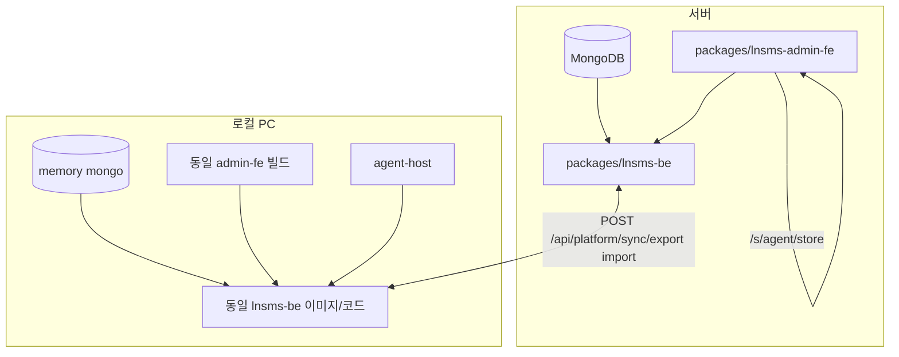

# LNSMS monorepo + 서브패스 구현 계획

> 새 Cursor 워크스페이스용 단일 계획서.  
> 이 폴더(`lnsms-acc-scaffold`)를 `lnsms_acc` monorepo로 옮긴 뒤, 이 문서를 **리포 루트 `plan.md`** 로 두고 작업한다.

---

## 0. 목표 (한 줄)

**서버·로컬에서 동일한 BE/FE**를 쓰고, **DB만 export/import로 동기화**한다.  
관리(Platform)는 전체 매장, **Store Site**는 **한 매장**만 (`/s/{agentId}/{storeId}`).  
매장 UI/BE 수정이 잦으므로 Platform과 **URL·코드 경로를 분리**한다.

---

## 1. 권장 리포 구조 (monorepo)

대상 GitHub: [delphism84/lnsms_acc](https://github.com/delphism84/lnsms_acc)

```
lnsms_acc/                          # git root
├── plan.md                         # ← 이 파일
├── README.md
├── docs/
│   ├── architecture-subpath.md
│   └── setid.md                    # req/req1/setid.md 통합·선행 수정
├── packages/
│   ├── lnsms-be/                   # Node Express + Mongo (Platform + Store API)
│   ├── lnsms-admin-fe/             # Next.js (Platform + Store UI, 동일 빌드)
│   ├── agent-host/                 # CareReceiverAgent.Host (시리얼/TCP/WebView)
│   └── agent-fe/                   # Vite 알림·설정 UI → wwwroot 또는 agent-host 연동
├── legacy/
│   ├── lunar-backend/              # lunar-agent-acc-web/backend (폐기 예정)
│   └── lnms-admin/                 # setid 트리 UI (흡수 후 삭제)
├── deploy/
│   ├── docker-compose.yml
│   └── nginx.conf.example
├── scripts/
│   ├── local-store.ps1             # memory mongo + BE + FE
│   └── sync-bundle.ps1             # (선택) CLI export/import
├── tools/
│   ├── lnuploader_ftp/
│   └── lnupdater/
└── resource/                       # app.json, icons (agent-host 참조)
```

### 기존 폴더 → 이동 매핑

| 현재 (로컬) | monorepo |
|-------------|----------|
| `lnsms_be/` | `packages/lnsms-be/` |
| `lnsms_admin_fe/` | `packages/lnsms-admin-fe/` |
| `lunar-agent-acc-web/CareReceiverAgent.Host/` | `packages/agent-host/` |
| `lunar-agent-acc-web/frontend/` | `packages/agent-fe/` |
| `lunar-agent-acc-web/backend/` | `legacy/lunar-backend/` |
| `lunar-agent-acc-web/lnms-admin/` | `legacy/lnms-admin/` |

별도 리포 [lnsms_be](https://github.com/delphism84/lnsms_be), [lnsms_admin_fe](https://github.com/delphism84/lnsms_admin_fe) → monorepo로 **흡수 후 archived**.

---

## 2. URL·API 규격 (서브패스, 컨테이너 없음)

| 영역 | UI | API |
|------|-----|-----|
| **Platform** | `/platform` | `/api/platform/*` |
| **Store site** | `/s/{agentId}/{storeId}/*` | `/api/s/{agentId}/{storeId}/*` |

- 매장 클릭 = **새 URL로 이동** (인스턴스 기동 없음).
- 로컬 PC = Store site **1매장 고정** (`STORE_AGENT_ID`, `STORE_STORE_ID` env).

### Platform API (요약)

- `GET/PUT/DELETE /api/platform/agents`
- `GET/POST/DELETE /api/platform/stores`, `GET .../stores/by-agent/:agentId`
- `POST /api/platform/sync/export` — body: `{ agentId, storeId }`
- `POST /api/platform/sync/import` — body: `{ agentId, storeId, bundle, mode: 'replace'|'merge' }`

### Store API (요약)

- `GET /api/s/:agentId/:storeId/context`
- `GET|POST|PUT|DELETE /api/s/.../categories`
- `GET|POST|PUT|DELETE /api/s/.../menus`
- `GET /api/s/.../eqids`, `DELETE .../eqids/category/:category`
- `.../sets`, `.../upload`, `.../did` — 레거시 라우트를 스코프 아래로 이전(진행 중)

**레거시** `/api/categories`, `/api/stores` 등은 전환 기간만 유지 후 제거.

---

## 3. 이미 스캐폴드에 구현된 것 (2026-05)

경로: `Documents/lnsms-acc-scaffold/packages/` (또는 복사 후 `packages/`)

### BE (`lnsms-be`)

- [x] `src/middleware/storeScope.js`
- [x] `src/routes/store/` — context, categories, menus, eqids
- [x] `src/routes/platform/` — agents, stores, sync(export/import 1차)
- [x] `src/index.js` — `/api/platform`, `/api/s/:agentId/:storeId` mount

### FE (`lnsms-admin-fe`)

- [x] `/platform` — 매장 목록 + 「매장 콘솔 열기」
- [x] `/s/[agentId]/[storeId]/setting` + device 페이지 복사
- [x] `AppShell` — `/platform`에서 Sidebar 숨김
- [x] `storeScopePaths.ts`, `platformApi.ts`, `storeApiScoped.ts`
- [x] Sidebar 링크 → `/s/...` 경로

### 미완 / 다음

- [ ] `categoryApi` / `menuApi` / `eqidApi` → `createStoreApi(agentId, storeId)` 로 교체
- [ ] `StoreDetailClient`가 scoped API만 사용하도록 수정
- [ ] sets/upload/did를 store 라우터에 **스코프 검증** 포함해 이전
- [ ] `docs/setid.md`에 sync bundle JSON 스키마 (setid-first 규칙)
- [ ] 로컬: `/` → `/s/{STORE_AGENT_ID}/{STORE_STORE_ID}` 리다이렉트
- [ ] Agent Host → `store-be` API 호출 (내장 JSON BE 축소)
- [ ] legacy `backend`, `lnms-admin` 제거

---

## 4. 새 Cursor에서 할 일 (순서)

### Step A — 워크스페이스 준비 (완료)

1. 이 폴더(`lnsms-acc-scaffold`)가 **git 루트** — `packages/`, `resource/`, `deploy/`, `scripts/`, `docs/`.
2. Cursor에서 `plan.md`가 있는 폴더를 워크스페이스로 연다.
3. 서버는 `deploy/docker-compose.yml` 또는 동일 패키지를 VM에 배포.

### Step B — 규격 (에이전트, 0.5일)

1. `docs/setid.md` 작성/이전 (`lunar-agent-acc-web/req/req1/setid.md` 기반).
2. sync bundle 필드: `version`, `agentId`, `storeId`, `storeRef`, `collections`, `files[]`, `exportedAt`.
3. `docs/architecture-subpath.md` 유지.

### Step C — BE 마무리 (1~2일)

1. `routes/store/` — upload, did, sets 스코프 래퍼.
2. Platform `stores` POST/DELETE와 기존 `routes/stores.js` 중복 정리.
3. sync import 시 `set_configs`는 `userid` 기준 매칭.
4. `.env.example`: `MONGODB_URI=memory`, `PORT=40000`.

### Step D — FE 마무리 (2~3일)

1. `StoreDetailClient` + modals → `createStoreApi` 사용.
2. `/s/.../device/*` 클라이언트가 `storeRef` query 유지 (기존 동작).
3. Platform: 매장 생성/삭제 UI (platformApi).
4. Platform: sync UI (export 다운로드 / import 업로드).
5. Store setting: 서버 DB 동기화 (upload/download via `/api/sync/*`).
5. `next.config.ts` rewrites — `/api/platform`, `/api/s` (이미 `/api/:path*`면 충분).

### Step E — 로컬·배포 (1일)

1. `scripts/local-store.ps1` 검증.
2. `deploy/docker-compose.yml` — mongo + lnsms-be + admin-fe.
3. nginx: `/`, `/platform`, `/s/`, `/api/` → FE/BE.

### Step F — Agent (1~2일, 병렬 가능)

1. `packages/agent-host` — `app.json`에 `StoreApiBase=http://localhost:40000`.
2. 알림/설정: 로컬 `store-be` + 필요 시 Platform sync.
3. `frontend` 빌드 산출물 → host `wwwroot` (기존 `build-and-run.bat` 경로 수정).

### Step G — 레거시 제거 (0.5일)

1. `legacy/lunar-backend`, `lnms-admin` README에 deprecated.
2. FE/Agent에서 `:60000` lnms API 제거 또는 sync 전용으로만 유지.
3. 레거시 `/api/*` 라우트 삭제 + CHANGELOG.

---

## 5. 환경 변수

### `packages/lnsms-be/.env`

```env
MONGODB_URI=memory
PORT=40000
UPLOAD_DIR=./uploads
```

서버:

```env
MONGODB_URI=mongodb://mongo:27017/lnsms
PORT=40000
```

### `packages/lnsms-admin-fe/.env.local`

```env
NEXT_PUBLIC_API_URL=http://localhost:40000
API_PROXY_TARGET=http://localhost:40000
```

로컬 단일 매장 (선택):

```env
NEXT_PUBLIC_MODE=local-store
NEXT_PUBLIC_STORE_AGENT_ID=your-agent
NEXT_PUBLIC_STORE_STORE_ID=your-store
```

---

## 6. 로컬 실행 체크리스트

```powershell
cd packages\lnsms-be
npm install
$env:MONGODB_URI="memory"; $env:PORT="40000"
npm run dev
```

```powershell
cd packages\lnsms-admin-fe
npm install
$env:NEXT_PUBLIC_API_URL="http://localhost:40000"
npm run dev
```

| URL | 기대 |
|-----|------|
| http://localhost:40000/health | `{ status: 'ok' }` |
| http://localhost:63001/platform | 매장 목록 |
| http://localhost:63001/s/{agent}/{store}/setting | 매장 UI (데이터 있을 때) |

---

## 7. Git / PR 단위 (권장)

| PR | 내용 |
|----|------|
| PR1 | monorepo 폴더 이동 + plan.md + README (구조만) |
| PR2 | BE storeScope + platform/sync (이미 있으면 “이동”) |
| PR3 | FE /platform + /s/setting 골격 |
| PR4 | FE api.ts → storeApiScoped 전환 |
| PR5 | sync UI + setid.md |
| PR6 | docker-compose + scripts |
| PR7 | agent-host 경로·빌드 스크립트 |
| PR8 | legacy 제거 |

---

## 8. 아키텍처 다이어그램



---

## 9. 새 Cursor 세션에 넣을 첫 프롬프트 (복사용)

```
리포 루트 plan.md를 읽고 Step C~D부터 이어서 구현해줘.
우선순위:
1) StoreDetailClient / api.ts를 createStoreApi(storeScope)로 전환
2) setid.md에 sync bundle 스키마 추가
3) 로컬 STORE_* env 시 / → /s/... 리다이렉트
워크스페이스: packages/lnsms-be, packages/lnsms-admin-fe
```

---

## 10. 참고

- 단일 리포 합치기: **권장** (이미 스캐폴드가 그 구조).
- 매장당 컨테이너 방식: **채택 안 함** → 서브패스만 사용.
- 스캐폴드 원본: `%USERPROFILE%\Documents\lnsms-acc-scaffold` (또는 `c:\rc\lnsms-acc-scaffold`)
